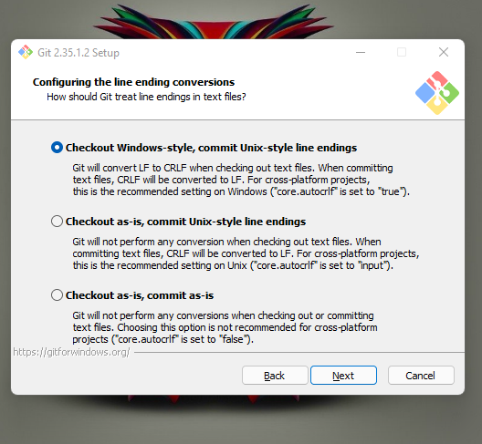

## _215611103 - Ichsan Munadi_
# Latihan

## A. Instalasi GIT di Windows
Sebelum install Git di Windows kita perlu mendownload [GIT](https://code.visualstudio.com/) terlebih dahulu.

1. Setelah selesai download Git, jalankan program GIT. Akan dimunculkan lisensi. Klik **Next** untuk lanjut.


2. Setelah itu, pilih lokasi instalasi. Secara default akan terisi C:\Program Files\Git. Ganti lokasi jika memang anda menginginkan lokasi lain, Klik **Next** untuk lanjut.


3. Pilih komponen. Tidak perlu diubah-ubah, sesuai dengan default saja. Klik pada **Next**.


4. Mengisi shortcut untuk menu Start. Gunakan default (Git), ganti jika ingin mengganti - misalnya Git VCS.


5. Pilih editor yang akan digunakan bersama dengan Git. Pada pilihan ini, digunakan Visual Studio Code.


6. Pada saat instalasi, kita bisa melakukan setting default branch saat melakukan git init, disini saya memilih main


7. Pada saat instalasi, Git menyediakan akses git melalui Bash maupun command prompt. Pilih pilihan kedua supaya bisa menggunakan dari dua antarmuka tersebut. Bash adalah shell di Linux. Dengan menggunakan bash di Windows, pekerjaan di command line Windows bisa dilakukan menggunakan bash - termasuk ekskusi dari Git.


8. Pilih **bundled OpenSSH** untuk HTTPS. Git menggunakan SSH untuk akes ke repo GitHub atau repo-repo lain (GitLab, Assembla).


9. Pilih **OpenSSL** untuk HTTPS. Git menggunakan https untuk akes ke repo GitHub atau repo-repo lain (GitLab, Assembla).


10. Pilih pilihan pertama untuk konversi akhir baris (CR-LF).


11. Pilih PuTTY untuk terminal yang digunakan untuk mengakses Git Bash.


12. Pilih Default untuk proses git pull.


13. Aktifkan **Git Credential Manager** pada proses ini. 


14. Untuk opsi ekstra, pilih serta aktifkan **Enable File System Caching**.


15. Setelah itu proses instalasi akan dilakukan.


16. Jika selesai akan muncul dialog pemberitahuan. Klik pada Finish.


17. Untuk menjalankan, dari Start, ketikkan **"Git"**, akan muncul beberapa pilihan. Pilih **"Git Bash"** atau **"Git GUI"**.


18. Tampilan jika akan menggunakan **Git Bash**


19. Tampilan jika akan menggunakan **Git GUI**


20. Untuk mencoba dari command prompt, masuk ke command prompt, setelah itu eksekusi "git --version" untuk melihat apakah sudah terinstall atau belum. Jika sudah terinstall dengan benar, makan akan muncul hasil berikut:


## B. Konfigurasi GIT
Untuk melakukan konfigurasi GIT kita bisa melakukan melalui Command prompt dengan memakai perintah sebagai berikut.

1. Konfigurasi Username dan Email
Isian di bawah harus disesuaikan dengan nama serta email yang digunakan untuk mendaftar di GitHub.
```sh
$ git config --global user.name "Nama Anda di GitHub"
$ git config --global user.email email@domain.tld
```

2. untuk melihat hasil konfigurasi dengan perintah 
```sh
$ git config --list
```
untuk hasilnya seperti ini


## C. Mengelola Repo Sendiri di Account Sendiri
Untuk membuat repo, gunakan langkah-langkan berikut:

1. Klik tanda + pada bagian atas setelah login, pilih **New repository**


2. Isikan nama, keterangan, serta lisensi. Jika dikehendaki, bisa membuat repo Private


## C. Mengelola Repo Sendiri di Organisasi
Untuk membuat repo, gunakan langkah-langkan berikut:

1. Masuk pada Organisasi Kalian lalu Klik tanda + pada bagian atas setelah login, pilih **New repository**


2. Isikan nama, keterangan, serta lisensi. Jika dikehendaki, bisa membuat repo Private
