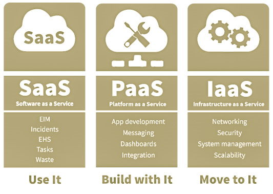

## _215611103 - Ichsan Munadi_

## A. Perbedaan Antara IaaS, SaaS, dan PaaS
1.	IaaS adalah infrastruktur sebagai layanan, IaaS ini menyediakan lingkungan bagi pengembang untuk membangun aplikasi yang dapat digunakan pengguna. Contohnya DigitalOcean, Linode, Rackspace, Amazon Web Services (AWS), Cisco Metapod, Microsoft Azure, Google Compute Engine (GCE).
2.	SaaS adalah perangkat lunak sebagai layanan yang artinya hanya menjalankan aplikasi di cloud publik. Pengguna menggunakan aplikasi ini melalui Internet. Aplikasi ini dikelola oleh Penyedia Layanan. Contohnya Dropbox, Google Apps, SalesForce, Microsoft (Office 365), Oracle.
3.	PaaS adalah platform sebagai layanan. PaaS ini mirim dengan SaaS yang membedakannya yaitu pada PaaS Pengembang menyediakan aplikasi yang dijalankan platform dan Mereka tidak secara langsung membuat VM, Contohnya Google App Engine, Stratos Apache, OpenShift, Windows Azure, AWS Elastic Beanstalk.

*tabel perbedaan antara IaaS, SaaS, dan PaaS*

## B. Arsitektur Platform SaaS
SaaS adalah perangkat lunak yang bisa digunakan dan diakses melalui internet tanpa harus melakukan pembelian program atau sistem, serta perangkat keras. Karena berada pada server dengan basis cloud, Anda tidak perlu mengunduh perangkat lunak jika ingin menggunakannya atau melakukan pembaharuan sistem. 
Penyedia SaaS menghosting aplikasi dan data secara terpusat hingga menyebarkan patch. Mereka meningkatkan ke aplikasi secara transparan, memberikan akses ke pengguna akhir melalui Internet. Banyak vendor menyediakan API yang digunakan pengembang untuk membuat aplikasi komposit. Ini berisi berbagai mekanisme keamanan untuk keamanan Data selama transmisi dan penyimpanan.
Dengan model ini, satu versi aplikasi, dengan konfigurasi tunggal digunakan untuk semua pelanggan. Aplikasi ini diinstal pada beberapa mesin untuk mendukung skalabilitas (disebut penskalaan horizontal). Dalam beberapa kasus, versi kedua dari aplikasi diatur untuk menawarkan sekelompok pelanggan tertentu dengan akses ke versi aplikasi pra-rilis untuk tujuan pengujian. Dalam model tradisional ini, setiap versi aplikasi didasarkan pada kode unik. Meskipun pengecualian, beberapa solusi SaaS tidak menggunakan multitenancy, untuk mengelola sejumlah besar pelanggan secara hemat biaya. Multitenancy adalah komponen yang diperlukan untuk SaaS adalah topik kontroversi. Ada dua varietas utama SaaS yaitu:
•	SaaS Vertikal yaitu Perangkat Lunak yang menjawab kebutuhan industri tertentu 
•	Horizontal SaaS yaitu Produk yang berfokus pada kategori perangkat lunak 
Selain itu terdapat kekurangan dari platform SaaS antara lain yaitu :
•	Kurangnya kontrol, karena aplikasi SaaS dihosting di lingkungan SaaS vendor, maka memiliki sedikit atau tidak ada kontrol atas perangkat lunak yang digunakan. 
•	Ekosistem terbatas, tidak dapat dipungkiri bahwa SaaS adalah tren yang berkembang sebagai saluran distribusi perangkat lunak. Yang mengatakan, masih banyak aplikasi yang tidak menawarkan versi yang dihosting.
•	Performa, Aplikasi in-house, tebal atau on-premise akan selalu berjalan lebih cepat daripada produk yang dikirim melalui internet.
•	Masalah Data, Saat memilih produk SaaS, dan misalnya, dengan munculnya GDPR, bisnis harus memberikan perhatian khusus dalam hal di mana implementasi SaaS menyimpan data di cloud. Setiap yurisdiksi memiliki kebijakan dan tindakan legislatifnya sendiri ketika data sensitif sedang diproses atau disimpan

## C. Cara Membuat Aplikasi SaaS dengan Menggunakan Cloud
Untuk membangun aplikasi SaaS kemungkinan besar membangunnya menggunakan cloud. Dalam Cloud memiliki banyak keuntungan  skalabilitas berbeda dengan menggunakan  lingkungan server lokal. Saat membangun produk untuk cloud berarti membangun produk dengan bahasa pemrograman modern. Selain kemampuan dan keterampilan, pilihan bahasa pemrograman juga penting. Dalam hal ini bisa menggunakan bahasa pemrograman Python. Python adalah bahasa pemrograman yang banyak digunakan, yang dirancang untuk menekankan pada keterbacaan kodenya. Python sangat bagus dan banyak pengembang menyukainya. Pengetikan dinamis, pemrograman meta, prototyping cepat. Selain itu Python termasuk dalam bahasa pemrograman yang aman. Selain bahasa pemrograman, penggunaan database juga sangat penting dalam hal ini disarankan menggunakan database dengan berorientasi dokumen. Database dokumen mendapatkan informasi jenisnya dari data itu sendiri. Dengan demikian setiap contoh data dapat berbeda dari yang lain. Hal ini memungkinkan lebih banyak fleksibilitas, terutama ketika berhadapan dengan perubahan. Dan itu sering mengurangi ukuran database atau konsep DOB menawarkan pengalaman yang lebih banyak dengan teknik pemrograman modern. Dalam hal ini bisa menggunakan MongoDB.  MongoDB adalah database berorientasi dokumen yang memberikan kinerja tinggi, ketersediaan tinggi, dan skalabilitas yang mudah. 
