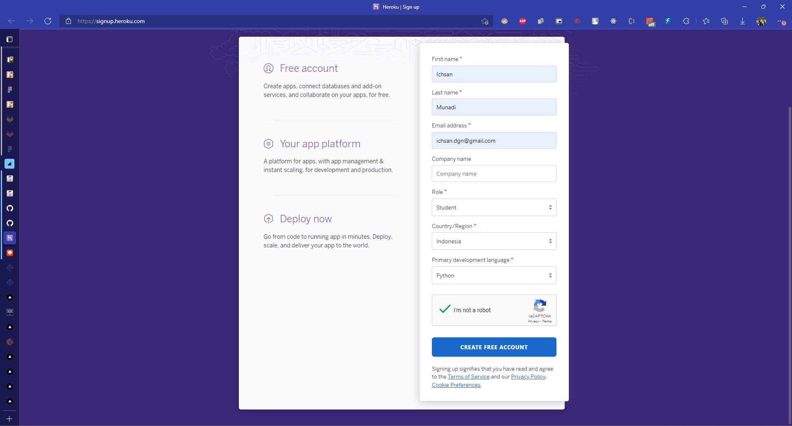
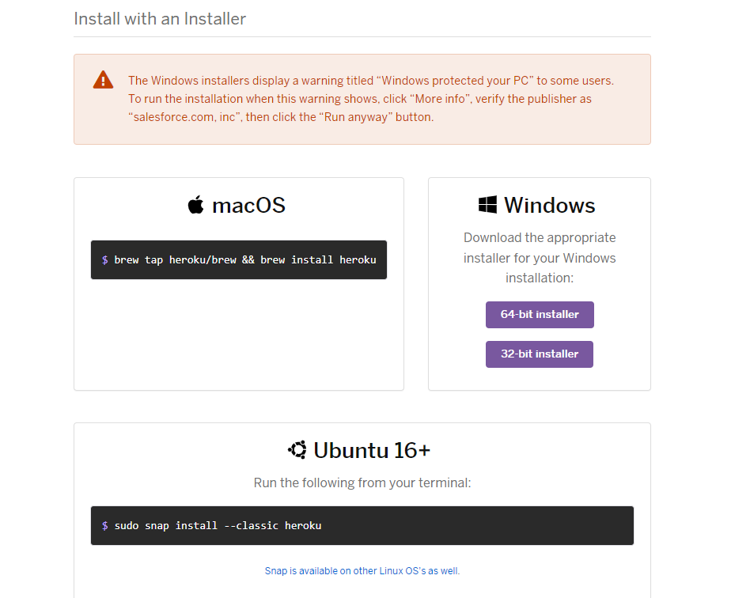
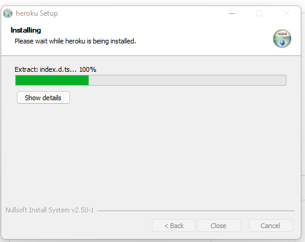
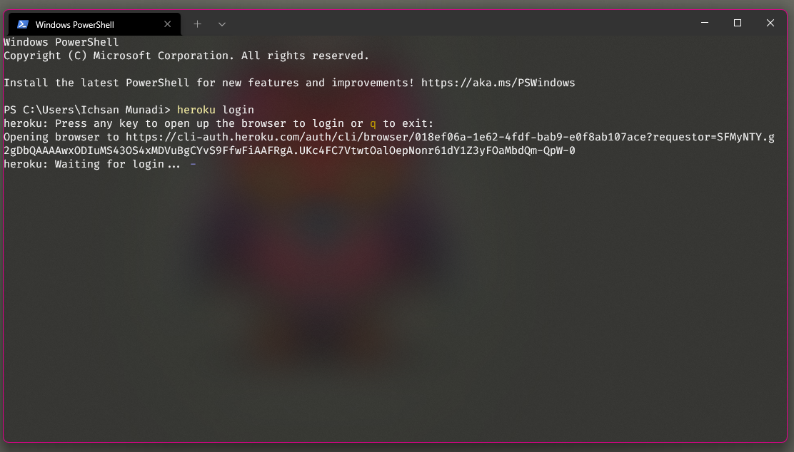
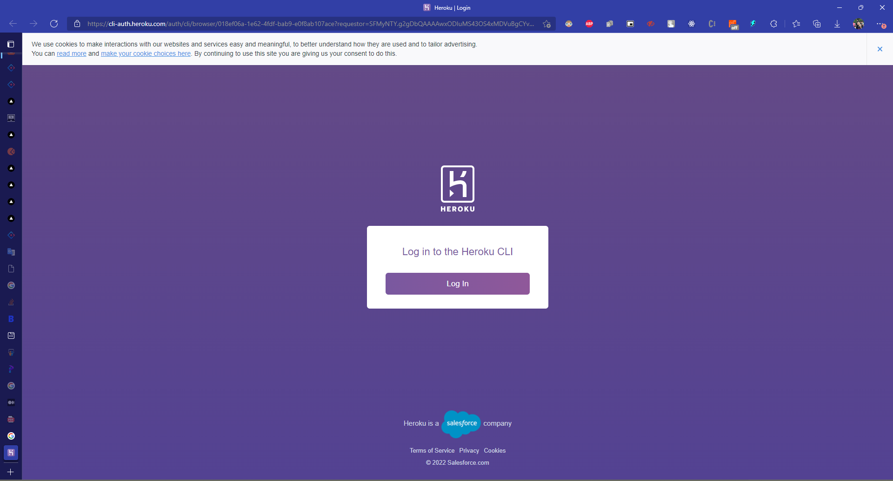
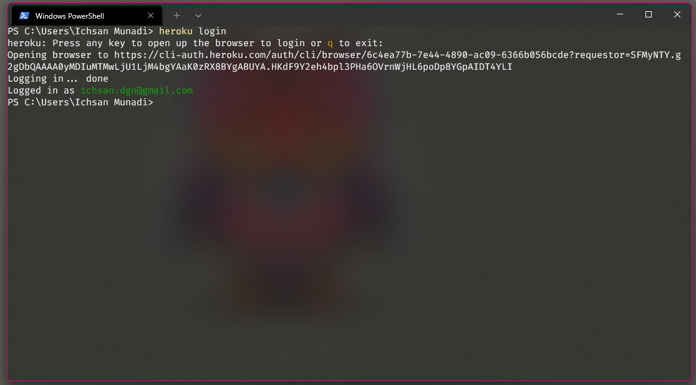
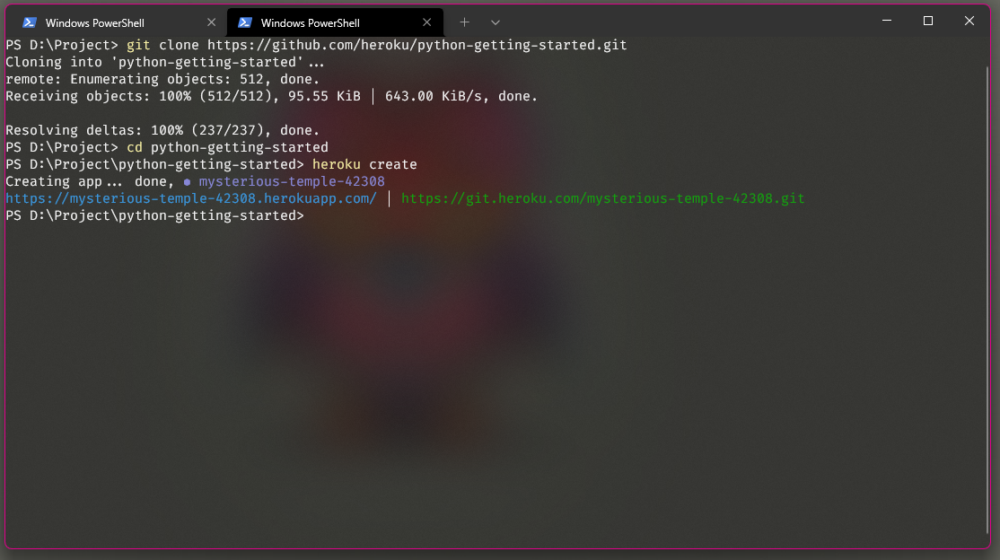
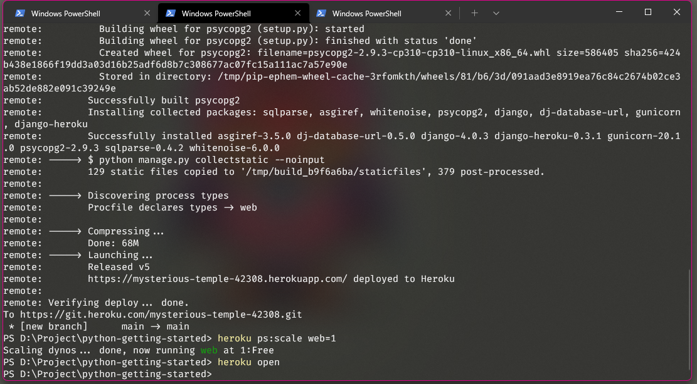
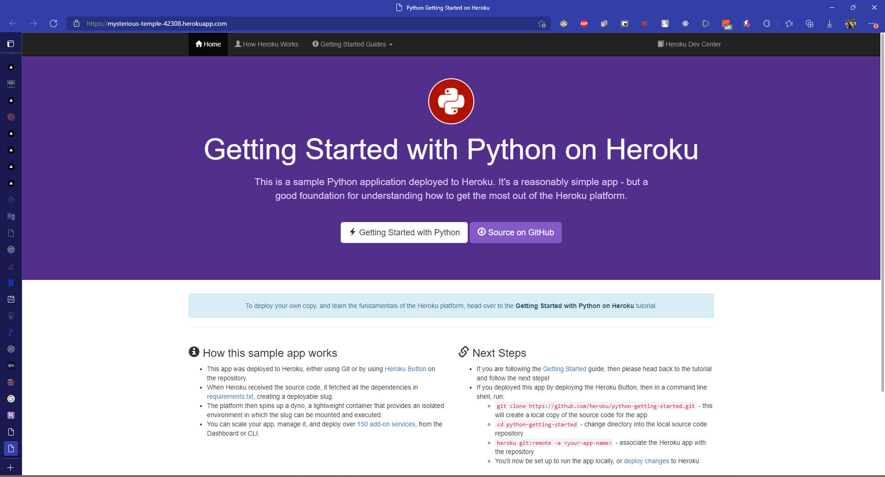

## _215611103 - Ichsan Munadi_

## A. Heroku
Heroku adalah sebuah cloud platform yang menjalankan bahasa pemrograman tertentu, Heroku mendukung bahasa pemrograman seperti Ruby, Node.js, Python, Java, PHP, dan lain-lain.Heroku termasuk ke dalam kriteria Platform As A Service (PaaS), sehingga bagi anda yang ingin melakukan deploy aplikasi ke heroku cukup hanya dengan melakukan konfigurasi aplikasi yang ingin di deploy dan menyediakan platform yang memungkinkan pelanggan untuk mengembangkan, menjalankan, dan mengelola aplikasi tanpa kompleksitas membangun dan memelihara infrastruktur yang biasanya terkait dengan pengembangan dan peluncuran aplikasi.

## B. Manfaat Heroku
Manfaat menggunakan Heroku adalah layanannya yaitu menjalankan script app langsung tanpa memerlukan setting yang sangat rumit, memungkinkan pengembang aplikasi lebih fokus pada kode aplikasi mereka, tanpa terlalu dipusingkan dengan arsitektur dan server.

## C. Memulai Dengan Heroku

1. [Registrasi user di heroku](https://signup.heroku.com/)

2. setelah registrasi berhasil, akan menerima email dari heroku untuk membuat password

3. setelah selesai membuat password akan diarahkan ke halaman dashboard heroku

## D. Getting Started on Heroku with Python

1. [Download Heroku CLi](https://devcenter.heroku.com/articles/heroku-cli)

2. Setelah selesai download, install Heroku CLI seperti dokumentasi diatas

3. Login Heroku CLI

Buka Terminal lalu ketikkan "heroku login", setelah itu akan diarahkan untuk membuka link browser

Setelah itu klik Login, Setelah Login terverifikasi buka kembali terminal

Jika Login terverfikasi akan muncul keterangan login seperti gambar diatas

4. Create New App Python
Buka Terminal, Clone aplikasi Python, setelah itu masuk ke direktori project aplikasi lalu jalankan "heroku create" setelah berhasil akan muncul link domain. domain tersebut alamat untuk membuka aplikasi yang sudah di buat tadi.

5. Buka Aplikasi lewat Browser
Inilah Hasil Aplikasi yang sudah di buat dengan layanan heroku.

