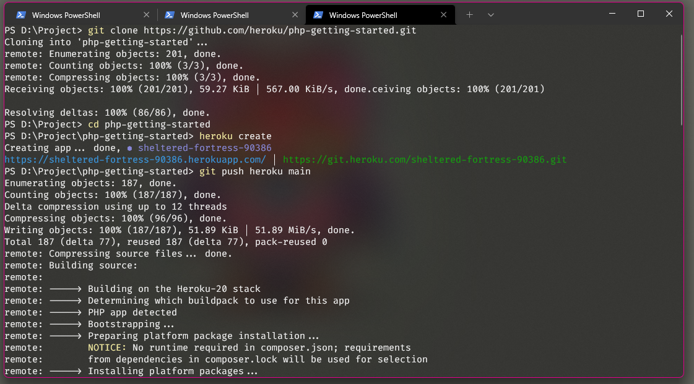
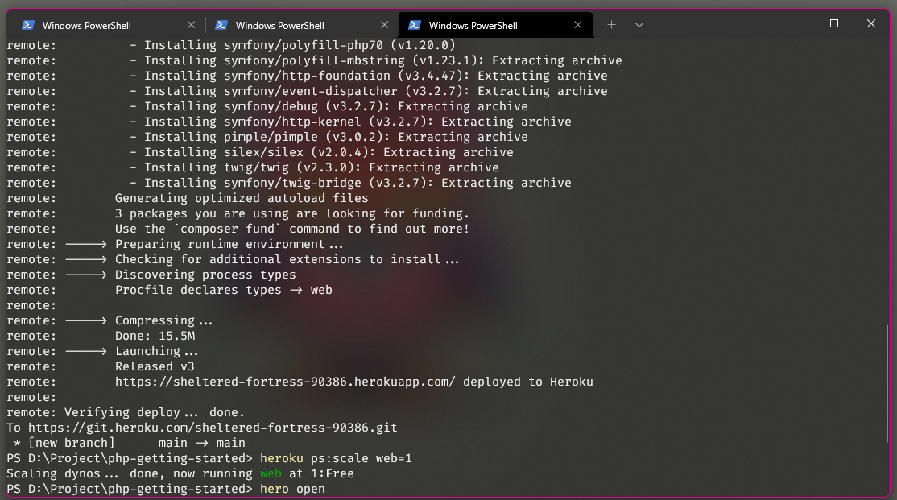
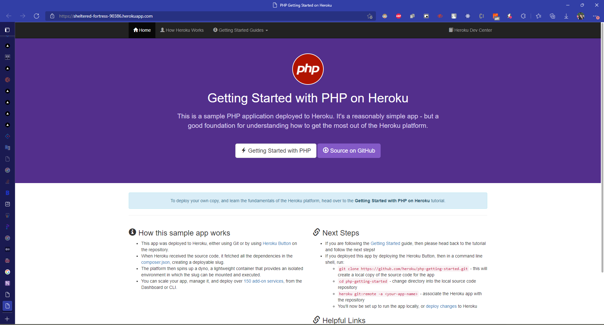

## _215611103 - Ichsan Munadi_

## Getting Started on Heroku with PHP

1. Create New App PHP
Buka Terminal, Clone aplikasi PHP, setelah itu masuk ke direktori project aplikasi lalu jalankan "heroku create" setelah berhasil akan muncul link domain. domain tersebut alamat untuk membuka aplikasi yang sudah di buat tadi.

2. Buka Aplikasi lewat Browser
Inilah Hasil Aplikasi yang sudah di buat dengan layanan heroku.

