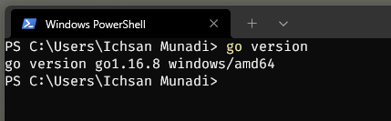
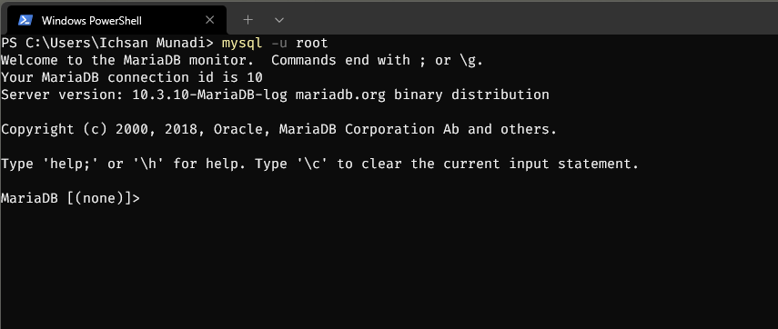
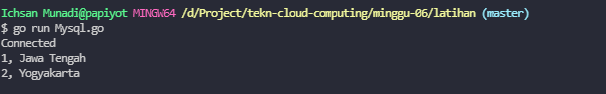
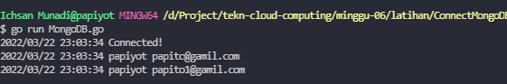
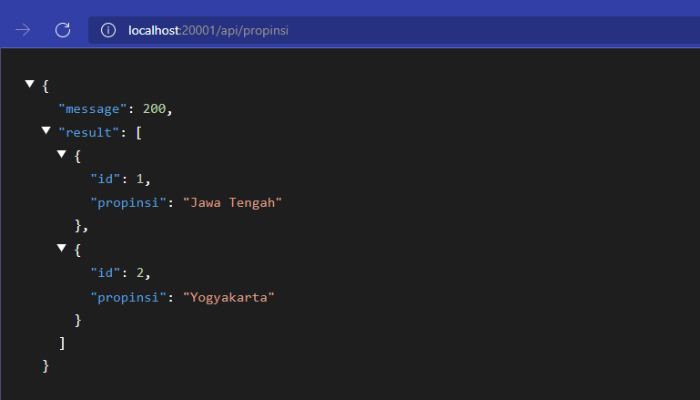
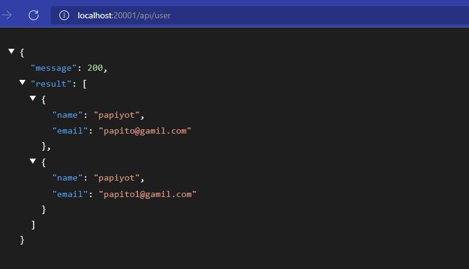

## _215611103 - Ichsan Munadi_

## Install GO
1. [Download Go](https://go.dev/dl/) sesuai OS yang digunakan
2. Setelah selesai download, kita install Go 
3. setelah berhasil install go, kita bisa mengeceknya menggunakan terminal



## Install MYSQL
1. [Download MYSQL](https://dev.mysql.com/downloads/installer/) sesuai OS yang digunakan
2. Setelah selesai download, kita install MYSQL 
3. setelah berhasil install MYSQL, kita bisa mengeceknya menggunakan terminal



## Install MONGODB
1. [Download MONGODB](https://www.mongodb.com/try/download/community) sesuai OS yang digunakan
2. Setelah selesai download, kita install MONGODB 
3. setelah berhasil install MONGODB, kita bisa mengeceknya menggunakan terminal


## Akses Database MYSQL dengan golang
1. Create Module Go dengan "go mod init example/latihan"
2. install library driver Mysql "go get github.com/go-sql-driver/mysql"
3. buat file Mysql.go, isi script seperti ini
```sh
package main

import (
	"database/sql"
	"fmt"

	_ "github.com/go-sql-driver/mysql"
)

type propinsi struct {
	id       int
	propinsi string
}

func (p propinsi) String() string {
	return fmt.Sprintf("%d, %s", p.id, p.propinsi)
}

func main() {
	db, err := sql.Open("mysql",
		"root@tcp(127.0.0.1:3306)/laravel")
	if err != nil {
		fmt.Println(err)
	} else {
		fmt.Println("Connected")
		// var id = 1
		rows, err := db.Query("select id, propinsi from propinsi ")
		if err != nil {
			fmt.Println(err.Error())
			return
		}
		defer rows.Close()

		var result []propinsi

		for rows.Next() {
			var each = propinsi{}
			var err = rows.Scan(&each.id, &each.propinsi)

			if err != nil {
				fmt.Println(err.Error())
				return
			}

			result = append(result, each)
		}

		if err = rows.Err(); err != nil {
			fmt.Println(err.Error())
			return
		}

		for _, each := range result {
			fmt.Println(each.String())
		}
	}
	defer db.Close()
}

```
4. Jalankan program dengan "go run Mysql.go"



## Akses Database MONGOFB dengan golang
1. Create Module Go dengan "go mod init example/latihan"
2. install library driver MongoDB "go get go.mongodb.org/mongo-driver/mongo"
3. buat file MongoDB.go, isi script seperti ini
```sh
package main

import (
	"context"
	"log"

	"go.mongodb.org/mongo-driver/bson"
	"go.mongodb.org/mongo-driver/mongo"
	"go.mongodb.org/mongo-driver/mongo/options"
	"go.mongodb.org/mongo-driver/mongo/readpref"
)

type Users struct {
	Name  string `json:"name"`
	Email string `json:"email"`
}

func GetClient() *mongo.Client {
	clientOptions := options.Client().ApplyURI("mongodb://localhost:27017")
	client, err := mongo.NewClient(clientOptions)
	if err != nil {
		log.Fatal(err)
	}
	err = client.Connect(context.Background())
	if err != nil {
		log.Fatal(err)
	}
	return client
}

func ReturnAllUsers(client *mongo.Client, filter bson.M) []*Users {
	var users []*Users
	collection := client.Database("coba").Collection("users")
	cur, err := collection.Find(context.TODO(), filter)
	if err != nil {
		log.Fatal("Error on Finding all the documents", err)
	}
	for cur.Next(context.TODO()) {
		var item Users
		err = cur.Decode(&item)
		if err != nil {
			log.Fatal("Error on Decoding the document", err)
		}
		users = append(users, &item)
	}
	return users
}

func main() {
	c := GetClient()
	err := c.Ping(context.Background(), readpref.Primary())
	if err != nil {
		log.Fatal("Couldn't connect to the database", err)
	} else {
		log.Println("Connected!")
	}

	users := ReturnAllUsers(c, bson.M{})
	for _, item := range users {
		log.Println(item.Name, item.Email)
	}
}

```
4. Jalankan program dengan "go run MongoDB.go"




## RESTful API Gin FrameWork MYSQL
1. Create Module Go dengan "go mod init example/gin-mysql"
2. install framework gin "go get -u github.com/gin-gonic/gin"
3. install library driver Mysql "go get github.com/jinzhu/gorm/dialects/mysql"
4. install library pendukung "go get github.com/jinzhu/gorm"
5. buat file main.go, isikan script dibawah ini
```sh
package main

import (
	"net/http"

	"github.com/gin-gonic/gin"
	"github.com/jinzhu/gorm"
	_ "github.com/jinzhu/gorm/dialects/mysql"
)

var db *gorm.DB

func init() {
	var err error
	db, err =
		gorm.Open("mysql", "root@tcp(127.0.0.1:3306)/laravel")
	if err != nil {
		panic("Gagal Conect Ke Database")
	}
}

type (
	propinsi struct {
		ID       int    `json:"id"`
		Propinsi string `json:"propinsi"`
	}
)

func fetchAllPropinsi(c *gin.Context) {
	var model []propinsi

	db.Find(&model)

	if len(model) <= 0 {
		c.JSON(http.StatusNotFound, gin.H{"message": http.StatusNotFound, "result": "Data Tidak Ada"})
	}

	c.JSON(http.StatusOK, gin.H{"message": http.StatusOK, "result": model})
}

func main() {

	router := gin.Default()
	v1 := router.Group("/api/propinsi")
	{
		v1.GET("", fetchAllPropinsi)
	}
	router.Run(":20001")
}

```

6. jalankan main.go "go run main.go"
7. buka browser akses http://localhost:20001/api/propinsi



## RESTful API Gin FrameWork MongoDB
1. Create Module Go dengan "go mod init example/gin-mongodb"
2. install framework gin "go get -u github.com/gin-gonic/gin"
3. install library driver MongoDB "go get go.mongodb.org/mongo-driver/mongo"
4. buat file main.go, isi script seperti ini
```sh
package main

import (
	"context"
	"log"
	"net/http"

	"github.com/gin-gonic/gin"
	"go.mongodb.org/mongo-driver/bson"
	"go.mongodb.org/mongo-driver/mongo"
	"go.mongodb.org/mongo-driver/mongo/options"
)

type Users struct {
	Name  string `json:"name"`
	Email string `json:"email"`
}

func GetClient() *mongo.Client {
	clientOptions := options.Client().ApplyURI("mongodb://localhost:27017")
	client, err := mongo.NewClient(clientOptions)
	if err != nil {
		log.Fatal(err)
	}
	err = client.Connect(context.Background())
	if err != nil {
		log.Fatal(err)
	}
	return client
}

func fetchAllUsers(c *gin.Context) {
	client := GetClient()
	var users []*Users
	collection := client.Database("coba").Collection("users")
	cur, err := collection.Find(context.TODO(), bson.M{})
	if err != nil {
		log.Fatal("Error on Finding all the documents", err)
	}
	for cur.Next(context.TODO()) {
		var item Users
		err = cur.Decode(&item)
		if err != nil {
			c.JSON(http.StatusNotFound, gin.H{"message": http.StatusNotFound, "result": "Data Tidak Ada"})
		}
		users = append(users, &item)
	}
	c.JSON(http.StatusOK, gin.H{"message": http.StatusOK, "result": users})
}

func main() {
	router := gin.Default()
	v1 := router.Group("/api/user")
	{
		v1.GET("", fetchAllUsers)
	}
	router.Run(":20001")
}

```
5. buka browser akses http://localhost:20001/api/user

