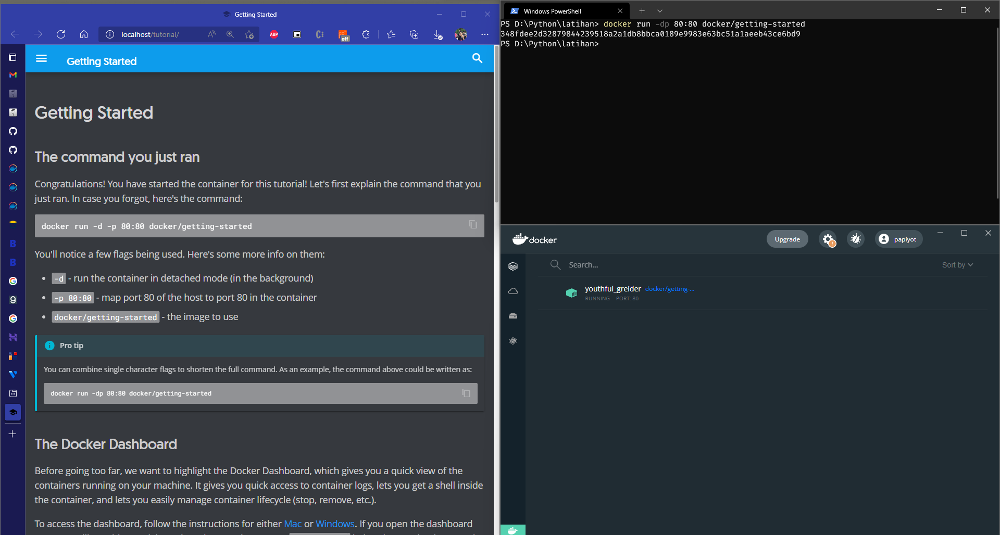
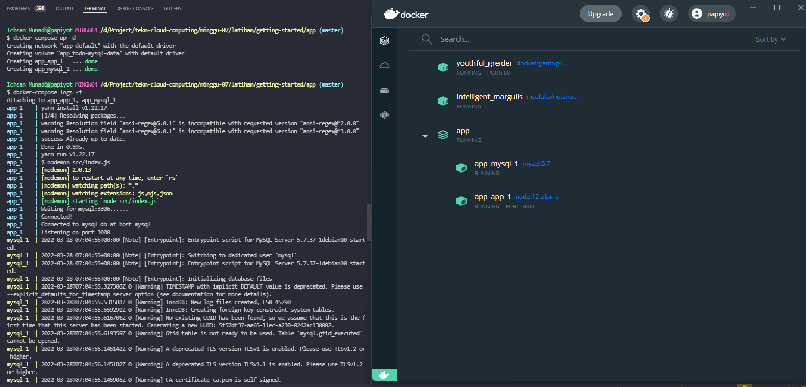
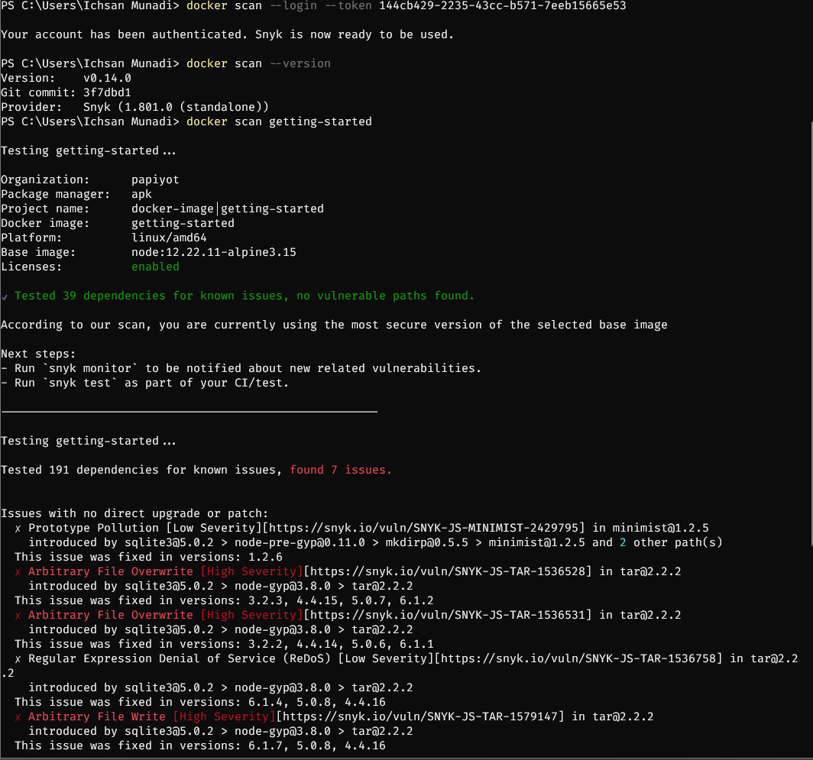

## _215611103 - Ichsan Munadi_

## Install Docker
1. [Download Docker](https://docs.docker.com/get-docker/) sesuai OS yang digunakan
2. Setelah selesai download, kita install Docker 
3. setelah berhasil install Docker, kita bisa membuka Desktop Docker


## Get Started - Docker
1. Buka Terminal
2. lalu ketikkan "docker run -dp 80:80 docker/getting-started" 
3. setelah itu buka browser http://localhost



## Sample application - Docker
1. [Clone Project Sample](https://github.com/docker/getting-started) 
2. Create Dockerfile pada folder app, buat script seperti ini
```sh
# syntax=docker/dockerfile:1
FROM node:12-alpine
RUN apk add --no-cache python2 g++ make
WORKDIR /app
COPY . .
RUN yarn install --production
CMD ["node", "src/index.js"]
EXPOSE 3000
```
3. Buka terminal dan masuk ke folder app, lalu jalankan perintah "docker build -t getting-started ."
4. setelah build docker selesai kita bisa jalankan image dengan perintah "docker run -dp 3000:3000 getting-started"
5. buka browser http://localhost:3000


## Update the application - Docker
1. Ubah Script/code pada src/static/js/app.js, ubah script pada line 56 menjadi seperti ini
```sh
<p className="text-center">You have no todo items yet! Add one above!</p>
```
2. Buka terminal dan masuk ke folder app, lalu jalankan perintah "docker build -t getting-started ."
3. setelah build docker selesai kita harus menghapus docker images yang tadi telah dijalankan. untuk itu kita bisa ketikkan "docker ps" untuk melihat images docker yang berjalan
5. lalu stop docker dengan "docker stop [the-container-id]"
6. lalu hapus docker dengan "docker rm [the-container-id]"
7. jalankan image dengan perintah "docker run -dp 3000:3000 getting-started"
4. buka browser http://localhost:3000


## Share the application - Docker
1. Masuk ke [Docker Hub](https://hub.docker.com/login).
2. buat Repository, buat dengan nama "getting-started" dengan status public


3. Login Docker Hub dengan "docker login -u YOUR-USER-NAME"


4. buat tag dengan "docker tag getting-started YOUR-USER-NAME/getting-started"
5. push docker ke repository dengan "docker push YOUR-USER-NAME/getting-started"


6. jalankan images Docker di [play docker](https://labs.play-with-docker.com/)


7. buka aplikasi dengan klik tombol open port masukkan port aplikasi yang ingin dibuka


## Persist the DB - Docker
1. gunakan perintah docker run -d ubuntu bash -c "shuf -i 1-10000 -n 1 -o /data.txt && tail -f /dev/null" untuk mendownload images ubuntu
2. lalu buka ubuntu CLI


3. buat docker volume dengan "docker volume create todo-db"
4. lalu jalankan "docker run -dp 3000:3000 -v todo-db:/etc/todos getting-started"
5. untuk mengeceknya bisa menggunakan "docker volume inspect todo-db"


## Use bind mounts - Docker
1. pastikan sebelum menjalankan images docker ini, tidak ada images docker getting-started yang berjalan.
2. jalankan perintah ini pada terminal untuk menjalankan images docker dalam mode pengembang
```sh
docker run -dp 3000:3000 \
     -w /app -v "$(pwd):/app" \
     node:12-alpine \
     sh -c "yarn install && yarn run dev"
```
3. lalu jalankan perintah "docker logs -f <container-id>" untuk mengecek log dari images docker yang dijalankan
4. setelah itu coba ubah script src/static/js/app.js pada line 109 menjadi seperti ini 
```sh
{submitting ? 'Adding...' : 'Add'}
```
5. setelah itu refresh link http://localhost:3000, maka otomatis perubahan pada aplikasi akan terlihat.


## Multi container apps - Docker
1. buat network dengan perintah "docker network create todo-app"
2. jalankan Mysql Container, dengan perintah dibawah ini
```sh
docker run -d \
     --network todo-app --network-alias mysql \
     -v todo-mysql-data:/var/lib/mysql \
     -e MYSQL_ROOT_PASSWORD=secret \
     -e MYSQL_DATABASE=todos \
     mysql:5.7
```
3. setelah berhasil menjalankan Mysql Container kita bisa mengeceknya dengan perintah "docker exec -it <mysql-container-id> mysql -u root -p"
4. masuk ke databasenya


5. jalankan perintah "docker run -it --network todo-app nicolaka/netshoot" untuk menghubungkan Mysql ke aplikasi
6.jalankan Aplikasi dengan menggunkan perintah ini untuk menghubungkan aplikasi dengan Mysql
```sh
docker run -dp 3000:3000 \
   -w /app -v "$(pwd):/app" \
   --network todo-app \
   -e MYSQL_HOST=mysql \
   -e MYSQL_USER=root \
   -e MYSQL_PASSWORD=secret \
   -e MYSQL_DB=todos \
   node:12-alpine \
   sh -c "yarn install && yarn run dev"
```
7. setelah itu buka aplikasi pada http://localhost:3000 lalu tambahkan data
8. lalu cek, apakah data sudah terecord pada database dengan perintah ini
```sh
docker exec -it <mysql-container-id> mysql -u root -p
use todos;
select * from todo_items;
```


## Docker Compose
1. Download dan install [docker composer](https://docs.docker.com/compose/install/)
2. setelah berhasil menginstall kita bisa mengecek dengan perintah "docker-compose version"
3. buat file docker-compose.yml lalu isikan script dibawah ini
```sh
version: "3.7"

services:
  app:
    image: node:12-alpine
    command: sh -c "yarn install && yarn run dev"
    ports:
      - 3000:3000
    working_dir: /app
    volumes:
      - ./:/app
    environment:
      MYSQL_HOST: mysql
      MYSQL_USER: root
      MYSQL_PASSWORD: secret
      MYSQL_DB: todos

  mysql:
    image: mysql:5.7
    volumes:
      - todo-mysql-data:/var/lib/mysql
    environment:
      MYSQL_ROOT_PASSWORD: secret
      MYSQL_DATABASE: todos

volumes:
  todo-mysql-data:
```
4. setelah itu jalankan docker compose dengan perintah "docker-compose up -d"



## Image-building best practices
1. Security scanning,berguna untuk mencari atau memastikan keamanan dari images yang kita buat. untuk mengeceknya kita bisa menggunakan perintah "docker scan <image-name>"


