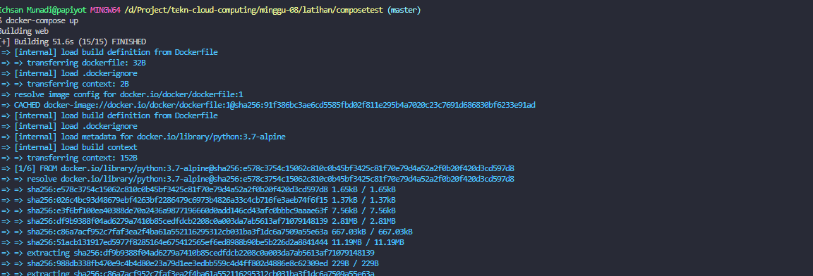
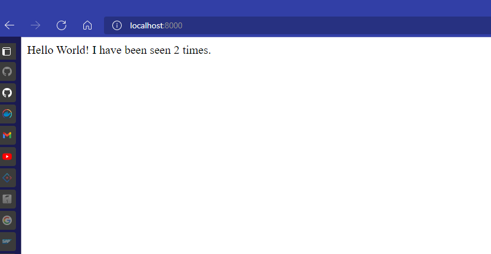
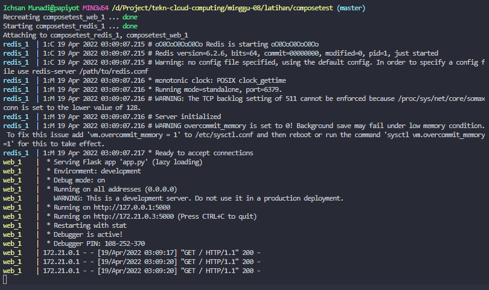
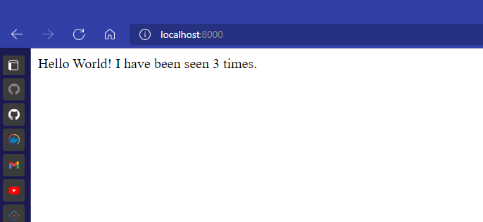

## _215611103 - Ichsan Munadi_


## Get started with Docker Compose
1. Create folder composetest
2. buat file app.py lalu isikan script dibawah ini
```sh
import time

import redis
from flask import Flask

app = Flask(__name__)
cache = redis.Redis(host='redis', port=6379)

def get_hit_count():
    retries = 5
    while True:
        try:
            return cache.incr('hits')
        except redis.exceptions.ConnectionError as exc:
            if retries == 0:
                raise exc
            retries -= 1
            time.sleep(0.5)

@app.route('/')
def hello():
    count = get_hit_count()
    return 'Hello World! I have been seen {} times.\n'.format(count)
```
3. buat file requirements.txt lalu isikan script dibawah ini
```sh
flask
redis
```
4. buat file Dockerfile lalu isikan script dibawah ini
```sh
# syntax=docker/dockerfile:1
FROM python:3.7-alpine
WORKDIR /code
ENV FLASK_APP=app.py
ENV FLASK_RUN_HOST=0.0.0.0
RUN apk add --no-cache gcc musl-dev linux-headers
COPY requirements.txt requirements.txt
RUN pip install -r requirements.txt
EXPOSE 5000
COPY . .
CMD ["flask", "run"]
```
5. buat file docker-compose.yml lalu isikan script dibawah ini
```sh
version: "3.9"
services:
  web:
    build: .
    ports:
      - "8000:5000"
  redis:
    image: "redis:alpine"
```
6. setelah itu jalankan docker compose dengan perintah "docker-compose up"



7. buka browser, buka link "localhost:8000"



8. ubah file docker-compose.yml lalu isikan script dibawah ini
```sh
version: "3.9"
services:
  web:
    build: .
    ports:
      - "8000:5000"
    volumes:
      - .:/code
    environment:
      FLASK_ENV: development
  redis:
    image: "redis:alpine"
```
9. setelah itu jalankan docker compose dengan perintah "docker-compose up"



10. buka browser, buka link "localhost:8000"


