## _215611103 - Ichsan Munadi_

# Section #1 - Networking Basics
## Step 1: The Docker Network Command
1. docker network

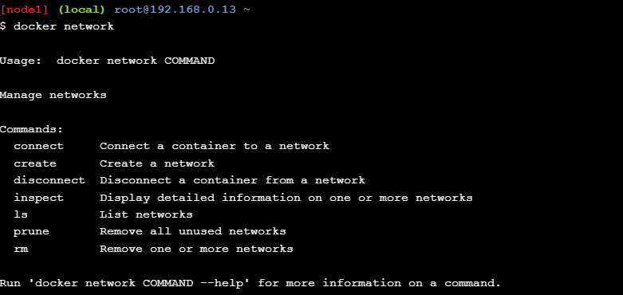

## Step 2: List networks
1. docker network ls

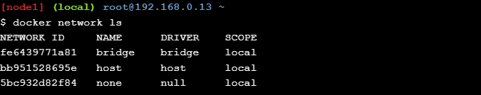

## Step 3: Inspect a network
1. docker network inspect bridge

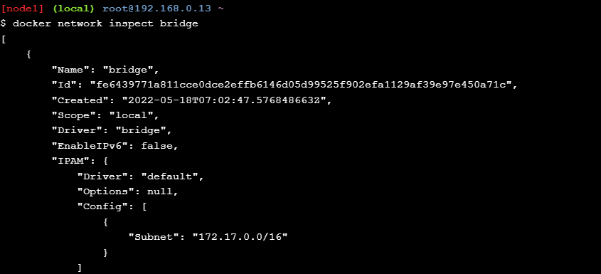

## Step 4: List network driver plugins
1. docker info

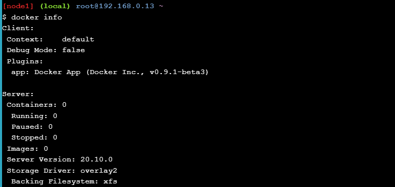

# Section #2 - Bridge Networking

## Step 1: The Basics
1. docker network ls
2. apk update
3. apk add bridge
4. brctl show
5. ip a

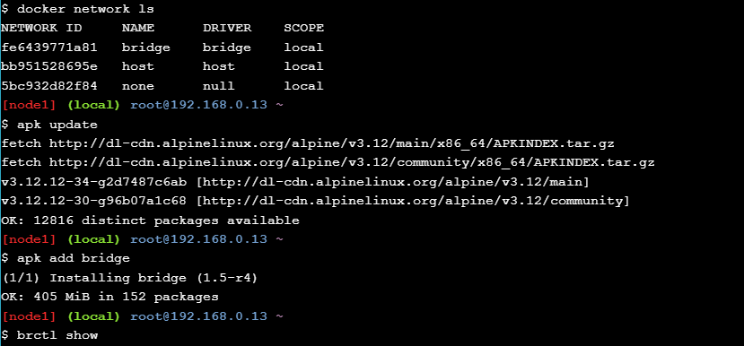

## Step 2: Connect a container
1.  docker run -dt ubuntu sleep infinity
2. docker ps
3. brctl show
4. docker network inspect bridge

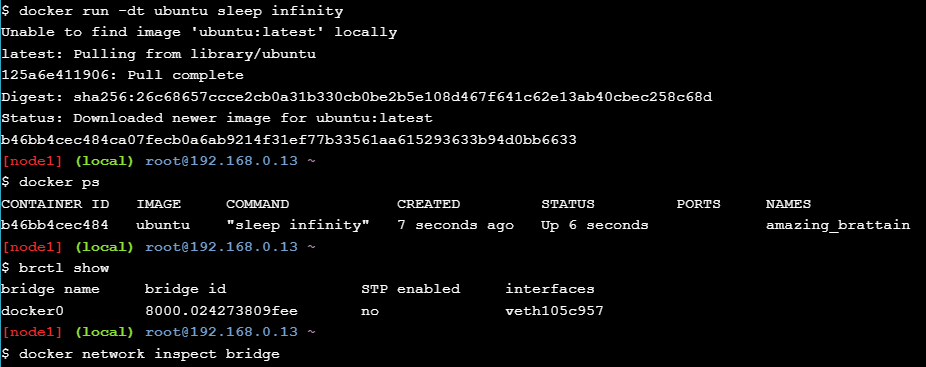

## Step 3: Test network connectivity
1. ping -c5 172.17.0.2

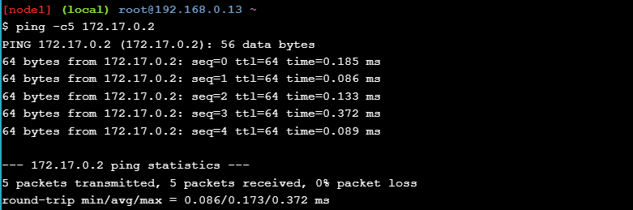

2.  docker ps
3.  ping -c5 www.github.com

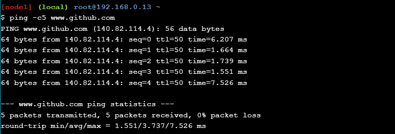

## Step 4: Configure NAT for external connectivity
1. docker run --name web1 -d -p 8080:80 nginx
2. docker ps
3. curl 127.0.0.1:8080

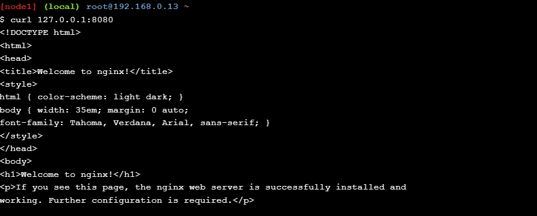

# Section #3 - Overlay Networking

## Step 1: The Basics
1. docker swarm init --advertise-addr $(hostname -i)
2. docker node ls

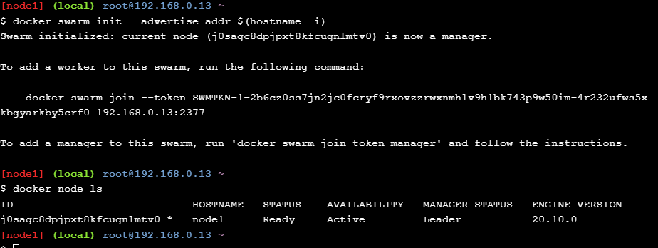

## Step 2: Create an overlay network
1. docker network create -d overlay overnet
2. docker network ls
3. docker network inspect overnet

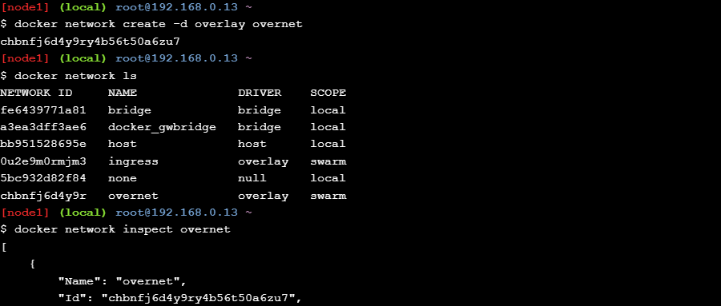

## Step 3: Create a service
1. docker service create --name myservice \ --network overnet \ --replicas 2 \ ubuntu sleep infinity
2. docker network ls
3. docker service ps myservice
4. docker network inspect overnet

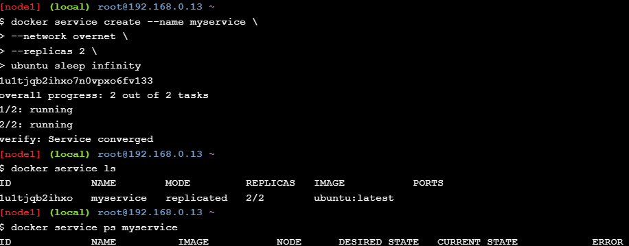

## Step 4: Test the network
1. docker network inspect overnet
2. docker ps
3. docker exec -it yourcontainerid /bin/bash
4. apt-get update && apt-get install -y iputils-ping
5. ping -c5 10.0.0.3

## Cleaning Up
1. docker service rm myservice
2. docker ps
3. docker kill c7bf9743d493 b46bb4cec484

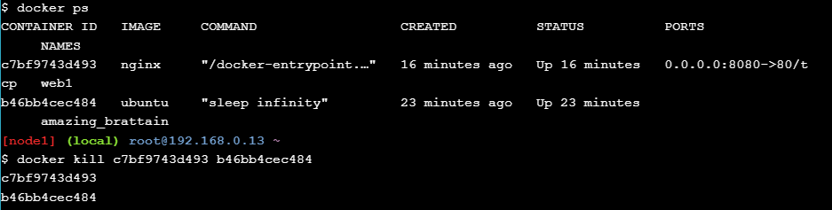

